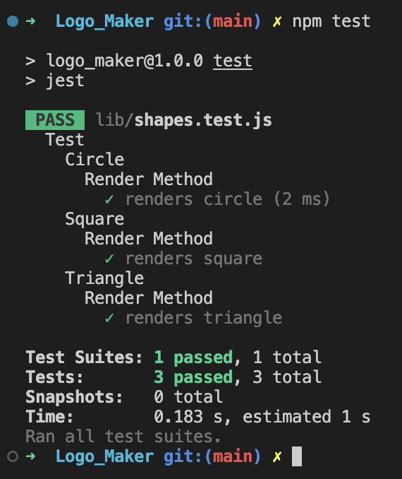
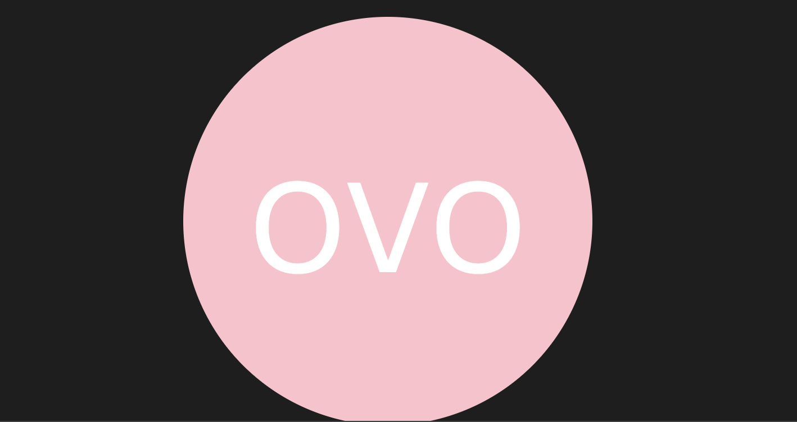
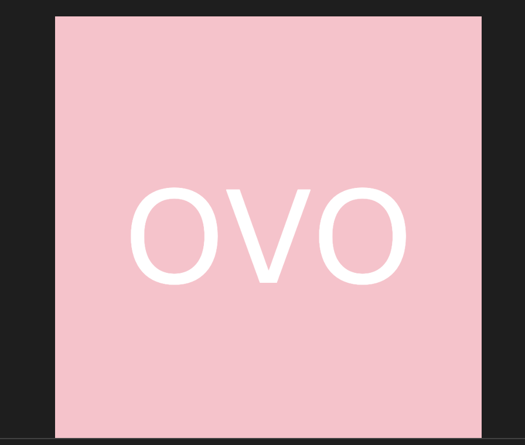

# SVG Logo Maker

## Description

A command-line application for creating custom logos and saving them as an SVG file. The user is prompted for input such as text, text color, shape, and shape color. The shape will either be a triangle, circle, or a square. Input is collected using the inquirer package and the generated SVG is saved as userLogo.svg. 

## Table of Contents

- [Installation](#installation)
- [User Story](#user-story)
- [Usage](#usage)
- [Technologies](#technologies)
- [Tests](#tests)
- [Application Screenshots](#technologies)
- [Demo Video](#demo-video)
- [Credits](#credits)
- [Websites](#websites)
- [Author](#author)
- [License](#license)

### Installation

1. Clone or download the repository to the Visual Studio Code
2. Open the command line in VS Code
3. nmp install to install the required dependencies 

### User Story 

- AS A freelance web developer
- I WANT to generate a simple logo for my projects
- SO THAT I don't have to pay a graphic designer 

### Usage

- The user will open Visual Studio Code 
- Inquirer will be used to gather information provided by the user
- Jest will be used to run the tests
- In the terminal the application will be invoked by using node index.js

### Technologies

- Visual Studio Code 
- Node.js
- npm install to install the required npm packages
- Inquirer 
- Jest 

### Tests

Tests can be run by using npm test in the command line in the VS Code 

### Application Screenshots 

- Tests

- Circle

- Square

- Triangle 

### Demo Video 

[SVG Logo Maker Demo Video](https://drive.google.com/file/d/15HUrX-G1gA5x3XjXc0a2DDVFIbfy5qAC/view)

### Credits 

- https://www.w3schools.com/graphics/svg_circle.asp
- https://www.w3schools.com/graphics/svg_polygon.asp 
- https://www.w3.org/2000/svg 

### Websites

- [Deployed Application](https://kimberlie901.github.io/Logo_Maker/)
- [Github](https://github.com/kimberlie901/Logo_Maker)

### Author 

This application was created by Kimberlie Guillaume

- [Github](https://github.com/kimberlie901)
- [Portfolio](https://kimberlie901.github.io/Professional_Portfolio/) 
- [LinkedIn](https://www.linkedin.com/in/kjguill1024/)

### License 

Please refer to the LICENSE in the repo.
Copyright (c) Kimberlie Guillaume. All rights reserved. 